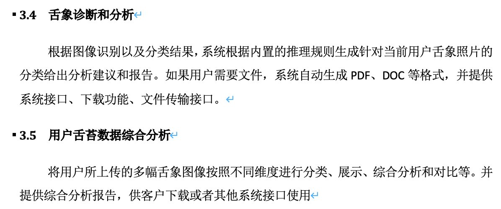

Author: 范文骁

---

需求

---

- 还有什么**用户场景**

- 论证技术的合理性
- 技术细节

---

### 舌苔照片识别和分析

分类模型采用3.1的模型，得出的结论直接输出到第三层

### 舌象诊断和分析（用户+医生/后台）

根据图像识别以及分类结果，系统根据内置的推理规则生成针对当前用户舌象照片的分类给出分析建议和报告。

- 内置的规则由决策树模型提供，一方面能够适应大数据，另一方面能够给出清晰、合理、可靠的解释，帮助医生用于诊断（智能化解读）
- 在用户上传的舌象图片上进行标注（利用上一个流程传递过来的特征），标注出用户的舌象的健康状态，同时提供个性化调理建议和方案，方法采用基于规则的模型（简单的匹配即可），为特殊人群提供朗读功能
- 在检测提供后提供在线健康咨询服务，对接社区医院、三甲医院等医疗资源
- 如果用户需要文件，系统自动生成PDF、DOC等格式，并提供系统接口、下载功能、文件传输接口。
- 通过用户在诊前、治疗过程及愈后的舌象特征检测，检测记录和报告加密存储到云端，在后续提醒用户持续监测，形成舌诊特征和健康状态的动态分析，使得用户针对一些疾病能够早发现早治疗
- 可以设置家人关心，将结果报告推送给同时推送给多个设置好的用户，方便及时关注家人健康
- 同时存储进入数据库（云端），为医生、医院提供大量病人的脱敏用例，使得医生能够根据这些病例分析总结规律变化，系统按照病种、病程、性别、年龄、职业、地区等多个维度建立数据分析模型，进行舌象特征与疾病变化规律的研究。

